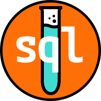

!!! Warning "In Development"
    ***This site is currently under development***. Please do not use it as a reference for finalized procedures, guides, or standards. 

## Welcome
This is the documentation site for `sql-unit-test`, a CLI tool that permits growing data teams to adopt test driven development best practices.

## Back Story
The idea that drove the development of this tool is the notion that we (data people) should be writing unit tests for each object in our datawarehouse. That way we are able to systematically confirm that our assets are behaving in a way that we expect they should. Furthermore, previously written unit tests should be retained in some centralized place (ideally a source controlled place) so that we can check if new developments break requirements from past developments.

There are tools on the market that accomplish this goal very effectively (read ['dbt'](https://docs.getdbt.com/)), however, for many organizations, the road to implementing dbt is a long one. In the meantime, it didn't seem like an option to simply opt out of what is (luckily) becoming a fundamental best practice in the data world. 

While it may not be as convenient and quick as declaring tests in dbt, `sql-unit-test` is certainly is a big step in the right direction. 
